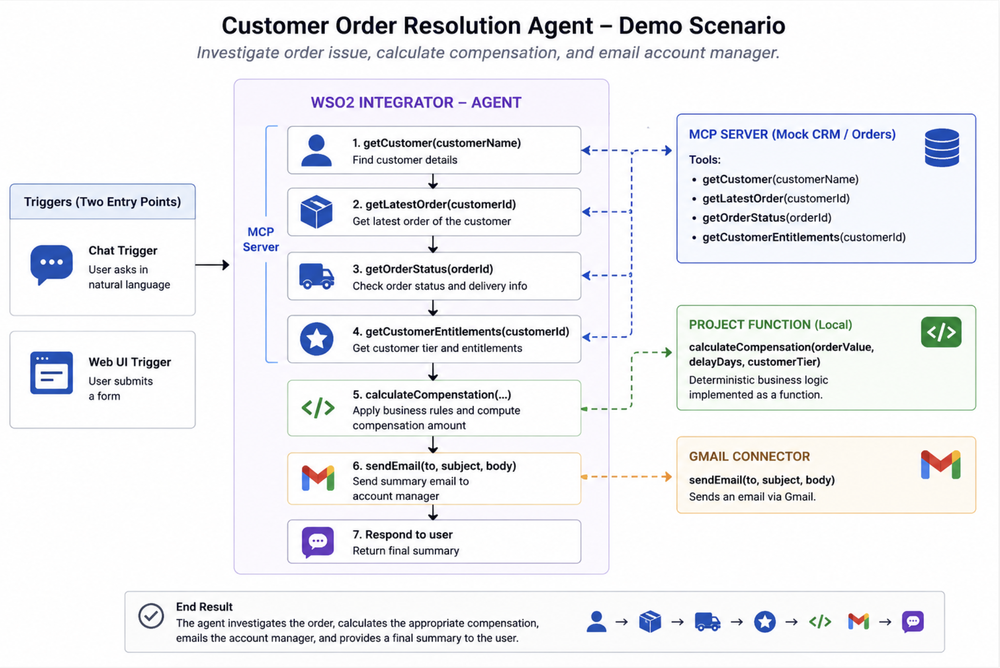

# Customer Service Demo

A demo of an AI agent that investigates customer order issues, calculates compensation for delays, and notifies the account manager by email — built with WSO2 Agent Builder. 



The demo has three components that run together:

```
┌─────────────┐      POST /api/customer/resolve      ┌───────────────────────┐
│   web/      │ ──────────────────────────────────▶  │ customer_case_resolver│
│ (static UI) │        http://localhost:9090         │      / cr_agent       │
└─────────────┘                                      │  (Ballerina AI agent) │
                                                     └───────────┬───────────┘
                                                                 │ MCP (findCustomer,
                                                                 │ getLatestOrder,
                                                                 │ getOrderStatus)
                                                                 ▼
                                                       ┌───────────────────────┐
                                                       │  customer-mcp-server   │
                                                       │ http://localhost:9092  │
                                                       │ (mock CRM / order data)│
                                                       └───────────────────────┘
```

The agent also calls a local `calculateCompensation` tool and sends email notifications via the Gmail API (`ballerinax/googleapis.gmail`).

## Components

### 1. `customer-mcp-server/`

A mock MCP server standing in for an enterprise Customer and Order Management System. Exposes exactly three tools over `mcp:StreamableHttpService`:

| Tool | Description |
|---|---|
| `findCustomer` | Look up a customer by name/alias. Returns customer ID, tier, and account manager, or an ambiguous-match/not-found result. |
| `getLatestOrder` | Get the most recent order for a customer ID. |
| `getOrderStatus` | Get an order's shipment status (delivered/in transit/delayed/cancelled), including delay reason and duration. |

Seed data for 6 mock customers (ACME, Globex, Initech, Umbrella, Stark, Wayne) lives in `data.bal`. All account-manager emails point to one configurable demo mailbox so the agent's notification emails land in a single inbox regardless of which customer is investigated.

Runs on port `9092` by default (`mcpServerPort` in `mcp_service.bal`), serving at `/mcp`.

### 2. `customer_case_resolver/cr_agent/`

The Ballerina AI agent that drives the resolution flow. It is a Ballerina workspace package (`customer_case_resolver/Ballerina.toml`) containing the `cr_agent` module.

- **`agents.bal`** — defines the agent's system prompt/instructions and wires up its tools: the `customerMCP` toolkit (restricted to `findCustomer`, `getLatestOrder`, `getOrderStatus`), `calculateCompensationTool`, and `postSendTool` (Gmail send).
- **`connections.bal`** — MCP client pointed at `http://localhost:9092/mcp`, and a Gmail client authenticated via OAuth refresh token.
- **`functions.bal`** — the compensation policy: 10% credit for delays > 5 days, 5% for 2–5 days, 0% otherwise.
- **`main.bal`** — exposes two HTTP endpoints:
  - `POST /ai-agent/chat` — free-form chat interface to the agent (`ai:ChatReqMessage`/`ai:ChatRespMessage`).
  - `POST /api/customer/resolve` — structured endpoint used by the web UI. Accepts `{ customer, issue, calculateCompensation, sendEmail }` and returns a `CustomerIssueResponse`. CORS is enabled for all origins.
- **`config.bal`** — configurable Gmail OAuth credentials (`refreshToken`, `clientId`, `clientSecret`), supplied via `Config.toml` (gitignored, not committed).

The agent's instructions enforce a strict flow: identify the customer → fetch the latest order → check its status → only calculate compensation for delayed orders → treat the compensation tool's output as authoritative (never invent a figure) → only email the account manager when asked, using the email address returned by the CRM (never invented) → avoid duplicate emails.

Runs on Ballerina's default HTTP listener, port `9090`.

### 3. `web/`

A static single-page UI ("CaseDesk — Order Resolution Center") for support operators. Plain HTML/CSS/JS, no build step or framework.

- **`index.html`** — case form (customer picker, issue description, toggles for "calculate compensation" and "notify account manager") and a resolution results panel.
- **`app.js`** — posts the form payload to `http://localhost:9090/api/customer/resolve` and renders the response (credit amount, order ID, notification status, reason).
- **`styles.css`**, **`favicon.svg`** — styling and branding.

Serve this folder with any static file server, or open `index.html` directly in a browser (CORS is already enabled on the agent side).

## Prerequisites

- WSO2 Agent Builder / WSO2 Integrator
- A Google Cloud OAuth client (client ID/secret) with Gmail API access, plus a refresh token for the account that should send notification emails

## Configuration

Both `customer-mcp-server` and `customer_case_resolver/cr_agent` read configuration from a `Config.toml` in their respective directories (gitignored — create your own, do not commit real credentials).

`customer_case_resolver/cr_agent/Config.toml` needs:

```toml
[ballerina.ai.wso2ProviderConfig]
serviceUrl = "<llm provider service url>"
accessToken = "<llm provider access token>"

[anupama.cr_agent]
refreshToken = "<gmail oauth refresh token>"
clientId = "<gmail oauth client id>"
clientSecret = "<gmail oauth client secret>"
```

`customer-mcp-server` runs with sensible defaults (mock data + demo mailbox) and needs no additional configuration unless you want to override `mcpServerPort` or `demoMailbox`.

## Running the demo

Start each component in its own terminal, in this order:

```bash
# 1. Mock CRM / order data (MCP server) — port 9092
cd customer-mcp-server
bal run

# 2. AI agent (depends on the MCP server) — port 9090
cd customer_case_resolver/cr_agent
bal run

# 3. Web UI — serve the static folder
cd web
python3 -m http.server 8000
# then open http://localhost:8000
```

Then, from the web UI, pick a customer, describe the issue, and click **Investigate & Resolve**. Try `ACME Corporation` (7-day delay, 10% credit), `Globex Corporation` (delivered, no compensation), or `Wayne Enterprises` (1-day delay, no compensation) to see the different flows.

You can also talk to the agent directly:

```bash
curl -X POST http://localhost:9090/ai-agent/chat \
  -H "Content-Type: application/json" \
  -d '{"message": "Investigate the latest order for Stark Industries and notify the account manager if it is delayed."}'
```

or hit the structured endpoint the web UI uses:

```bash
curl -X POST http://localhost:9090/api/customer/resolve \
  -H "Content-Type: application/json" \
  -d '{"customer": "ACME Corporation", "issue": "Latest shipment has not arrived", "calculateCompensation": true, "sendEmail": true}'
```
